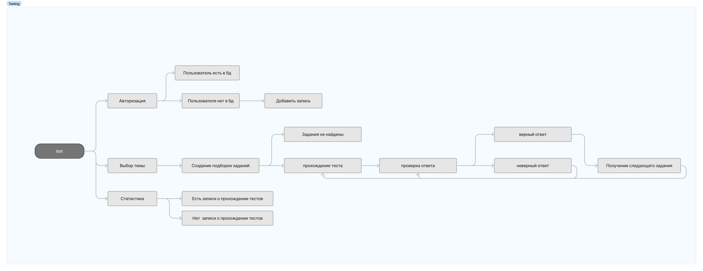
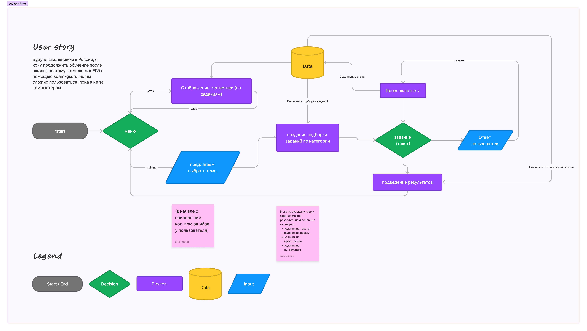
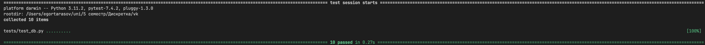

# Отчет тестирования

## MindMap

## Краткое описание

Были описаны тесты для бизнес логики приложения.
Тестами покрыты функции отвечающие за изменения состояния системы и генерации новых "вариантов" тестов для пользователей. Подробнее можно посмотреть в "tests/test_db.py"

Там были протестированы основные сущности приложения DBManager и StateStorage, которое позволяет нам отслеживать положение пользователя в процессе взаимодействия с ботом. Там сохраняется информация о вопросах и ответах пользователя, а также о текущем состоянии теста.

### UserFlow

## Результаты

В результате тестирования выявлены следующие дефекты:

-   в создаваемом варианте не учитываллись предыдущие правильные попытки
-   Когда пользователь ответил на все вопросы, то бот падал в ошибку ProblemsNotFound  

Написание тестов позволило исправить эти ошибки.

